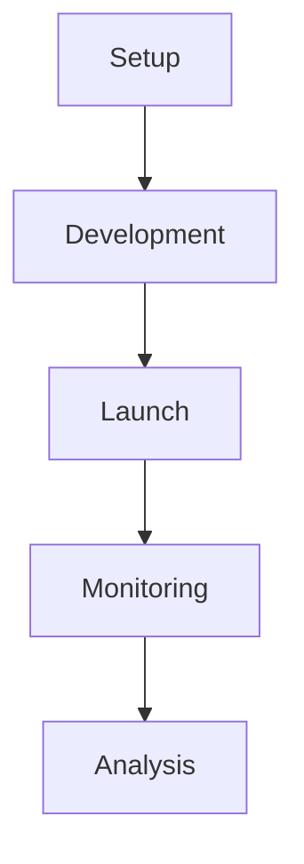

# Amazon Mturk API Walkthrough

### Introduction 
Amazon Mechanical Turk (AMT) is a well-known example of a multi-sided crowdsourcing platform that acts as a matchmaker, as described by Evans and Schmalensee (2017). It connects requesters, who post microtasks, “small, atomic tasks that workers can complete in their web browser”, with workers who complete them, while Amazon earns a commission on each transaction (AMT 2025).

add screenshots here, for the doc, MTurk interface, side by side

### CLI, RUI, and API

#### Comparison -- Why API is the best
| **Feature / Tool**               | **RUI (Requester User Interface)**       | **CLI (Command Line Interface)**        | **API (Application Programming Interface)**            |
| -------------------------------- | ----------------------------- | --------------------------------------- | ------------------------------------------- |
| What it is                   | Web-based UI on MTurk website | Command-line tool (Python/Java)         | RESTful web service (HTTP-based)            |
| Skill level                  | Beginner-friendly             | Intermediate (terminal + scripts)       | Advanced (coding experience needed)         |
| Setup                        | No setup needed               | Requires installation & config          | Requires API key, SDK, or manual HTTP       |
| Task creation                | Manual via form               | Semi-automated (scripts)                | **Fully automated**                   |
| Batch size                   | Small to moderate             | Moderate to large                       | **Large-scale**                |
| Worker qualifications        | Point-and-click setup         | Via XML/JSON files                      | **Full control via code**                       |
| Bonuses & approvals          | Manual                        | Batch scripts                           | **Fully automated**                             |
| Monitoring / tracking        | Visual dashboard              | CSV output                              | **Real-time** logs & custom dashboards          |
| Integration with other tools | Low                           | Medium  | High (connect to databases, web apps, etc.) |
| Best for                     | Casual users, small studies   | Researchers with scripting needs        | Power users, data scientists, developers    |

sources: [Implementing Amazon Mechanical Turk](https://docs.aws.amazon.com/AWSMechTurk/latest/AWSMechanicalTurkGettingStartedGuide/NextSteps.html#advanced-functionality); [blog.mturk.com](https://blog.mturk.com/helpful-tips-for-choosing-the-right-mechanical-turk-interface-d4c2c84d58e9) 

### What requesters can do with MTurk APIs (Visualization) 

## Roadmap Diagram

# Infrastructural Inversion 
warning screenshot, soup to rest 

put together a paragragh here 

# Discussion 

Platforms such as AMT, as part of the larger Amazon ecosystem, can enforce their own rules on complementors whenever a regulatory issue arises.

Should the state interfere? If so, to what extent and in what way?

add gifs 

# references 
 
# table chart 

<table>
  <thead>
    <tr>
      <th class="col-name">Name</th>
      <th class="col-description">Description</th>
      <th class="col-syntax">Request Syntax</th>
    </tr>
  </thead>
  <tbody>
    <tr>
      <td>AcceptQualificationRequest</td>
      <td>Grants a Worker’s request for a Qualification. Only the Qualification type’s owner can grant such requests.</td>
      <td>{ "QualificationRequestId": "string", "IntegerValue": integer }</td>
    </tr>
    <tr>
      <td>ApproveAssignment</td>
      <td>The ApproveAssignment operation approves the results of a completed assignment created with the API. Approving an assignment initiates two payments from the Requester's Amazon.com account: the Worker who submitted the results is paid the reward specified in the HIT, and Amazon Mechanical Turk fees are debited. If the Requester's account does not have adequate funds, the approval call returns an exception and is not processed.</td>
      <td>{ "QualificationRequestId": "string", "IntegerValue": integer }</td>
    </tr>
    <tr>
      <td>AssociateQualificationWithWorker</td>
      <td>The AssociateQualificationWithWorker operation gives a Worker a Qualification. It does not require the Worker to submit a request and grants the Qualification immediately.</td>
      <td>{ "QualificationTypeId": "string", "WorkerId": "string", "IntegerValue": integer, "SendNotification": boolean }</td>
    </tr>
    <tr>
      <td>CreateAdditionalAssignmentsForHIT</td>
      <td>The CreateAdditionalAssignmentsForHIT operation increases the maximum number of assignments of an existing HIT. Specify how many additional assignments to add.</td>
      <td>{ "HITId": "string", "NumberOfAdditionalAssignments": integer, "UniqueRequestToken": "string" }</td>
    </tr>
    <tr>
      <td>CreateHIT</td>
      <td>The CreateHIT operation creates a new HIT (Human Intelligence Task) with specified properties like title, reward, duration, and more. A new HITTypeId is generated for the HIT.</td>
      <td>{ "Title": "string", "Description": "string", "Question": "string", "HITLayoutId": "string", "HITLayoutParameters": HITLayoutParameterList, "Reward": "string", "AssignmentDurationInSeconds": integer, "LifetimeInSeconds": integer, "Keywords": "string", "MaxAssignments": integer, "AutoApprovalDelayInSeconds": integer, "QualificationRequirements": QualificationRequirementList, "AssignmentReviewPolicy": ReviewPolicy, "HITReviewPolicy": ReviewPolicy, "RequesterAnnotation": "string", "UniqueRequestToken": "string" }</td>
    </tr>
    <tr>
      <td>CreateHITType</td>
      <td>The CreateHITType operation creates a new HIT type. CreateHITType lets you be explicit about which HITs ought to be the same type. It also gives you error checking, to ensure that you call the CreateHITWithHITType operation with a valid HIT type ID. If you register a HIT type with values that match an existing HIT type, the HIT type ID of the existing type will be returned.</td>
      <td>{ "Title": String,"Description": String,"Reward": String, "AssignmentDurationInSeconds": Integer,"Keywords": String, "AutoApprovalDelayInSeconds": Integer, "QualificationRequirements": QualificationRequirementList} </td>
    </tr>
    <tr>
      <td>CreateHITWithHITType</td>
      <td>The CreateHITWithHITType operation creates a new Human Intelligence Task (HIT) using an existing HITTypeID generated by the CreateHITType operation. This is an alternative way to create HITs from the CreateHIT operation. This is the recommended best practice for Requesters who are creating large numbers of HITs.</td>
      <td>{ "HITTypeId": String, "Question": String, "HITLayoutId": String, "HITLayoutParameters": HITLayoutParameterList, "LifetimeInSeconds": Integer, "MaxAssignments": Integer, "AssignmentReviewPolicy": ReviewPolicy, "HITReviewPolicy": ReviewPolicy, "RequesterAnnotation": String, "UniqueRequestToken": String }</td>
    </tr>
    <tr>
      <td>CreateQualificationType</td>
      <td>The CreateQualificationType operation creates a new Qualification type, which is represented by a QualificationType data structure.</td>
      <td>{ "Name": String, "Description": String, "Keywords": String, "RetryDelayInSeconds": Non-negative integer, "QualificationTypeStatus": String, "Test": String, "AnswerKey": String, "TestDurationInSeconds": Integer, "AutoGranted": Boolean, "AutoGrantedValue": Integer }</td>
    </tr>
    <tr>
      <td>CreateWorkerBlock</td>
      <td>The CreateWorkerBlock operation allows you to prevent a Worker from working on your HITs. For example, you can block a Worker who is producing poor quality work. You can block up to 100,000 Workers.</td>
      <td>{ "WorkerId": String, "Reason": String }</td>
    </tr>
    <tr>
      <td>DeleteHit</td>
      <td>The DeleteHIT operation disposes of a HIT that is no longer needed. Only the Requester who created the HIT can delete it.</td>
      <td>{"HITId": String}</td>
    </tr>
    <tr>
      <td>DeleteQualificationType</td>
      <td>The DeleteQualificationType disposes a Qualification type and disposes any HIT types that are associated with the Qualification type.</td>
      <td>{"QualificationTypeId": String}</td>
    </tr>
    <tr>
      <td>DeleteWorkerBlock</td>
      <td>The DeleteWorkerBlock operation allows you to reinstate a blocked Worker to work on your HITs. This operation reverses the effects of the CreateWorkerBlock operation. You need the Worker ID to use this operation. If the Worker ID is missing or invalid, this operation fails and returns the message “WorkerId is invalid.” If the specified Worker is not blocked, this operation returns successfully.</td>
      <td>{"WorkerId": String,"Reason": String}</td>
    </tr>
  </tbody>
</table>

