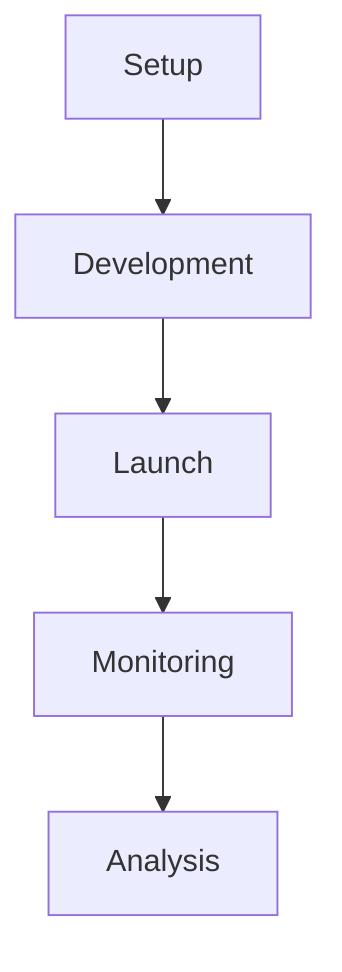

# Amazon Mturk API Walkthrough

### Intrduction 
Amazon Mechanical Turk (AMT) is a well-known example of a multi-sided crowdsourcing platform that acts as a matchmaker, as described by Evans and Schmalensee (2017). It connects requesters, who post microtasks, “small, atomic tasks that workers can complete in their web browser”, with workers who complete them, while Amazon earns a commission on each transaction (AMT 2025).

add screenshots here, for the doc, MTurk interface, side by side

### CLI, RUI, and API

#### Comparison -- Why API is the best
| **Feature / Tool**               | **RUI (Requester User Interface)**       | **CLI (Command Line Interface)**        | **API (Application Programming Interface)**            |
| -------------------------------- | ----------------------------- | --------------------------------------- | ------------------------------------------- |
| What it is                   | Web-based UI on MTurk website | Command-line tool (Python/Java)         | RESTful web service (HTTP-based)            |
| Skill level                  | Beginner-friendly             | Intermediate (terminal + scripts)       | Advanced (coding experience needed)         |
| Setup                        | No setup needed               | Requires installation & config          | Requires API key, SDK, or manual HTTP       |
| Task creation                | Manual via form               | Semi-automated (scripts)                | **Fully automated**                   |
| Batch size                   | Small to moderate             | Moderate to large                       | **Large-scale**                |
| Worker qualifications        | Point-and-click setup         | Via XML/JSON files                      | **Full control via code**                       |
| Bonuses & approvals          | Manual                        | Batch scripts                           | **Fully automated**                             |
| Monitoring / tracking        | Visual dashboard              | CSV output                              | **Real-time** logs & custom dashboards          |
| Integration with other tools | Low                           | Medium  | High (connect to databases, web apps, etc.) |
| Best for                     | Casual users, small studies   | Researchers with scripting needs        | Power users, data scientists, developers    |

sources: [Implementing Amazon Mechanical Turk](https://docs.aws.amazon.com/AWSMechTurk/latest/AWSMechanicalTurkGettingStartedGuide/NextSteps.html#advanced-functionality); [blog.mturk.com](https://blog.mturk.com/helpful-tips-for-choosing-the-right-mechanical-turk-interface-d4c2c84d58e9) 

### What requesters can do with MTurk APIs (Visualization) 

## Roadmap Diagram

# Infrastructural Inversion 
warning screenshot, soup to rest 

put together a paragragh here 

# Discussion 

Platforms such as AMT, as part of the larger Amazon ecosystem, can enforce their own rules on complementors whenever a regulatory issue arises.

Should the state interfere? If so, to what extent and in what way?

add gifs 

# references 
